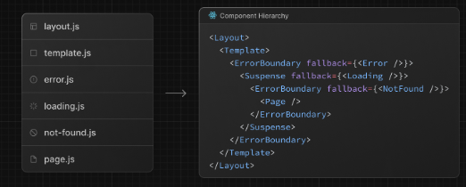

## 라우팅 기본 사항

애플리케이션의 뼈대는 라우팅입니다. 이 페이지에서는 웹 라우팅의 기본 개념과 Next.js에서 라우팅을 처리하는 방법을 소개

## 용어

먼저 문서 전체에서 자주 사용되는 용어를 살펴보겠습니다. 여기에 대한 간단한 참고 자료를 제공함.

- 트리: 계층적 구조를 시각화 하기 위한 규칙 예를 들어, 부모 및 자식 컴포넌트 트리, 폴더 구조 등.
- 서브트리: 새로운 루트(첫 번째)에서 시작하여 리프(마지막)에서 끝나는 트리의 일부.

- 루트: 트리 또는 서브트리의 첫 번째 노드, 예를 들어 루트 레이아웃.

- 리프: 자식이 없는 서브트리의 노드, 예를 들어 URL 경로의 마지막 세그먼트

- URL 세그먼트: 슬래시로 구분된 URL 경로의 일부

- URL 경로: 도메인 이후에 오는 URL의 일부로 세그먼트로 구성됨

## APP 라우터

버전 13에서 Next.js는 공유 레이아웃, 중첩 라우팅, 로딩 상태, 오류 처리 등을 지원하는 React Server Components 기반의 새로운 App Router를 도입했습니다.

App Router는 app이라는 새로운 디렉토리에서 작동함. app 디렉토리는 pages 디렉토리와 함께 작동하여 점진적인 도입을 허용함. 이를 통해 애플리케이션의 일부 경로를 새로운 동작으로 전환하면서 다른 경로는 이전 동작을 위해 pages 디렉토리에 유지할 수 있다. 애플리케이션이 pages 디렉토리를 사용하는 경우, Pages Router 문서도 참조하세요.

기본적으로 app 내부의 컴포넌트는 React Server Components임. 이는 성능 최적화이며 쉽게 도입할 수 있다. 또한 Client Components도 사용할 수 있다.

## 폴더와 파일의 역할

Next.js는 파일 시스템 기반의 라우터를 사용하여 다음과 같은 역할을 함.

- 폴더는 경로를 정의하는 데 사용됨. 경로는 루트 폴더에서 시작하여 page.js 파일을 포함하는 최종 리프 폴더까지 파일 시스템 계층을 따르는 중첩 폴더의 단일 경로임. 라우트 정의를 참조.

- 파일은 경로 세그먼트에 대해 표시되는 UI를 생성하는 데 사용됨. 특수 파일을 참조하세요.

## 경로 세그먼트

경로의 각 폴더는 경로 세그먼트를 나타냄. 각 경로 세그먼트는 URL 경로의 해당 세그먼트에 매핑됨.

## 중첩 경로

중첩 경로를 생성하려면 폴더를 서로 중첩시킬 수 있음. app 디렉토리에 두 개의 새 폴더를 중첩하여 `/dashboard/settings` 경로를 추가할 수 있다.

`/dashboard/settings` 경로는 세 개의 세그먼트로 구성됨.

- / (루트 세그먼트)
- dashboard (세그먼트)
- settings (리프 세그먼트)

## 파일 규칙

Next.js는 중첩 경로에서 특정 동작을 가진 UI를 생성하기 위해 일련의 특수 파일을 제공합니다:

|------|---|---|
|layout| |세그먼트와 자식에 대한 공유 UI|
|page| |경로의 고유한 UI로 경로를 공개적으로 접근 가능하게 만듭니다.|
|loading| |세그먼트와 자식에 대한 로딩 UI|
|not-found| |세그먼트와 자식에 대한 Not Found UI|
|error| |세그먼트와 자식에 대한 오류 UI|
|global-error| |글로벌 오류 UI|
|route| |서버 사이드 API 엔드포인트|
|template| |특수한 재렌더링된 레이아웃 UI|
|default| |병렬 경로에 대한 폴백 UI|

## 컴포넌트 계층 구조

특수 파일에 정의된 React 컴포넌트는 특정 계층 구조로 렌더링됩니다.

layout.js
template.js
error.js (React 오류 경계)
loading.js (React 서스펜스 경계)
not-found.js (React 오류 경계)
page.js 또는 중첩 layout.js

## 콜로케이션

특수 파일 외에도 app 디렉토리의 폴더 안에 자신의 파일(예: 컴포넌트, 스타일, 테스트 등)을 콜로케이트할 수 있습니다.

이는 폴더가 경로를 정의하지만, page.js 또는 route.js에서 반환된 내용만 공개적으로 접근할 수 있기 때문입니다.

## 고급

라우팅 패턴

App Router는 더 고급 라우팅 패턴을 구현하는 데 도움이 되는 일련의 규칙도 제공함.

- 병렬 경로: 동시에 두 개 이상의 페이지를 동일한 뷰에 표시하고 독립적으로 탐색할 수 있습니다.

- 경로 인터셉트: 경로를 인터셉트하고 다른 경로의 컨텍스트에서 표시할 수 있다. 현재 페이지의 컨텍스트를 유지하는 것이 중요한 경우에 사용할 수 있다.
