# 1장

## 이 장에서 학습할 최적화 기법

- 이미지 사이즈 최적화
- 코드 분할
- 텍스트 압축
- 병목 코드 최적화

### 이미지 사이즈 최적화

우리는 웹 서비스에 매우 다양한 이미지를 사용함.
하지만 너무 큰 사이즈의 이미지를 무분별하게 사용한 네트워크 트래픽이 증가해 서비스 로딩이 오래 걸림.

### 코드 분할

리액트 개발자라면 한번 쯤 들어 봤을 것.
SPA의 특성상 모든 리액트 코드가 하나의 자바스크립트 파일로 번들링되어 로드되기 때문에, 첫 페이지 진입 시 당자 사용하지 않는 코드가 다소 포함되어 있다.

### 텍스트 압축

html, css, 자바스크릅티 등이 포함되어 있는데, 이런 리소스는 다운로드 전에 서버에서 미리 압축할 수 있다.
그러면 원래 사이즈보다 더 작은 사이즈로 다운로드할 수 있어 웹 페이지가 더 빠르게 로드됨.

### 병목 코드 최적화

특정 자바스크립트 코드 때문에 서비스가 너무 느리게 다운로드되거나 느리게 실행되는 경우가 있다. 이때 어떤 코드가 무엇 때문에 느린지 몰라서 코드를 보며 한참 헤맨다. 이처럼 서비스를 느리게 만드는 코드를 병목 코드라고 함.

## 분석 틀 소개

### 크롭 개발자 도구의 Network 패널

웹 개발을 공부할 때 크롬 브라우저의 Network 패널을 한번쯤 사용해 봤을 것

이 패널은 현재 웹 페이지에서 발생하는 모든 네트워크 트래픽을 상세하게 알려줌.

### 크롬 개발자 도구의 Performance 패널

웹 페이지가 로드될 때, 실행되는 모든 작업 보여줌.
Network 패널에서 봤던 리소스가 로드되는 타이밍뿐만 아니라, 브라우저의 메인 스레드에서 실행되는 자바스크립트를 차트 형태로 보여줌.

### 크롭 개발자 도구의 Lighthouse 패널

구글에서 만든 툴로 웹 사이트 성능을 측정하고 개선 방향을 제시해 주는 자동화 툴임. Lighthouse를 이용하여 웹 사이트의 성능 점수를 측정하고 개선 가이드를 학인함으로써 어떤 부분을 중점적으로 분석하고 최적화해야 하는지 알 수 있다.

### webpack-bundle-analyzer

직접 설치해야 하는 툴.
webpack을 통해 번들링된 파일이 어떤 코드, 즉 어떤 라이브러리를 담고 있는지 보여 줌. 이 툴을 사용해 최종적으로 완성된 번들 파일 중 불필요한 코드가 어떤 코드이고, 번들 파일에서 어느 정도의 비중을 차지하고 있는지 확인할 수 있음.

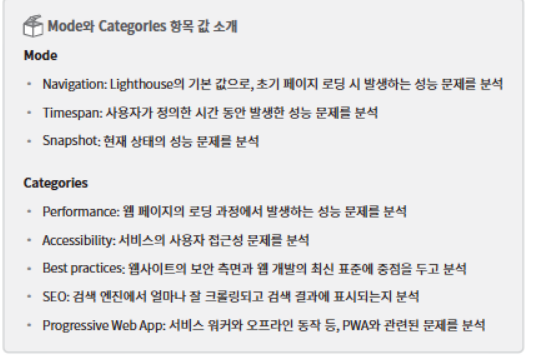

## Lighthouse 측정

### First Contentful Paint(FCP)

FCP는 페이지가 로드될 때 브라우저가 DOM 콘텐츠의 첫 번째 부분을 렌더링 하는 데 걸리는 시간에 관한 지표임. 위 결과 페이지에 진입하여 첫 콘텐츠가 뜨기까지 1.4초 걸렸음 FCP는 총점을 계산할 때, 10%의 가중치를 갖는다.

### Speed Index(SI)

SI는 페이지 로드 중에 콘텐츠가 시각적으로 표시되는 속도를 나타내는 지표임.

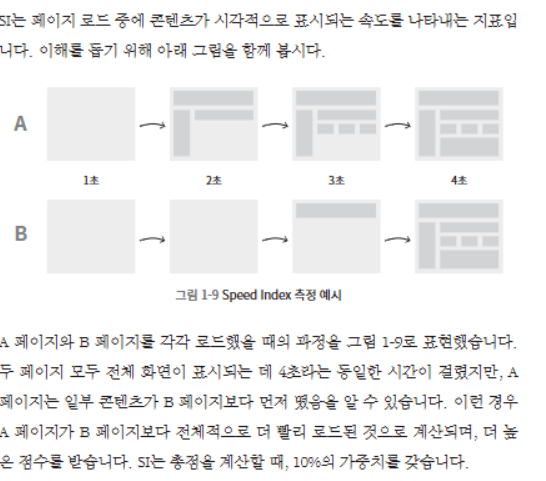

### Largest Contentful Paint(LCP)

LCP는 페이지가 로드될 떄 화면 내에 있는 가장 큰 이미지나 텍스트 요소가 렌더링되기까지 걸리는 시간을 나타내는 지표. LCP는 총점을 계산할 때 25%의 가중치를 갖는다.

### Time to Interactive(TTI)

TTI는 사용자가 페이지와 상호 작용이 가능한 시점까지 걸리는 시간을 측정한 지표
상호 작용이란 클릭 또는 키보드 누름 같은 사용자 입력을 의미함. 총점 계산할 때, 10%의 가중치를 갖는다.

### Total Blocking Time(TBT)

페이지가 클릭, 키보드 입력 등의 사용자 입력에 응답하지 않도록 차단된 시간을 총합한 지표. 측정은 FCP와 TTI 사이의 시간 동안 일어나며 메인 스레드를 독점하여 다른 동작을 방해하는 작업에 걸린 시간을 총합. TBT는 총점을 계산할 때, 30%의 가중치를 갖는다.

### Cumulative Layout Shift(CLS)

페이지 로드 과정에서 발생하는 예기치 못한 레이아웃 이동을 측정함.

레이아웃 이동이란 화면상에서 요소의 위치나 크기가 순간적으로 변하는 것을 말함.
CLS는 총점을 계산할 때, 15% 가중치를 갖는다.

Opportunities라는 섹션과 Diagnostic라는 섹션이 있음.

이 두 섹션은 웹 페이지의 문제점과 해결 방안, 그리고 문제를 해결함으로써 얻을 수 있는 이점이 무엇인지 보여 줌. Opportunities 섹션은 페이지를 더욱 빨리 로드하는 데 잠재적으로 도움 되는 제안을 나열하며, Diagnostics 섹션은 로드 속도와 직접적인 관계는 없지만 성능과 관련된 기타 정보를 보여줌.

Emaulated Desktop과 custom throttling임.
각 항목을 클릭하면 추가적인 정보를 볼 수 있음.

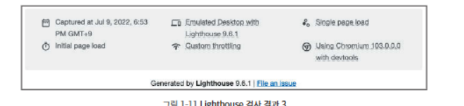

Emaulted Desktop 추가 정보에서는 CPU throttling이라는 정보를 확인할 수 있음.
이는 기기의 CPU 성능을 어느정도 제한하여 검사를 진행했는지를 나타냄. 1x로 되어 있는 것으로 보아 CPU 성능에 제한을 두지 않고 검사했음을 알 수 있음. 모바일은 4x로 표시됨.

Custom throttling에는 Network throttling이라는 정보가 있다. 이는 네트워크 속도를 제한하여 어느 정도 고정된 네트워크 환경에서 성능을 측정했다는 의미임.

## 이미지 사이즈 최적화

### 비율적인 이미지 분석

Opportunities 섹션의 첫 번째 항목인 Properly size images임
이는 적절한 사이즈로 사용하도록 제안함.

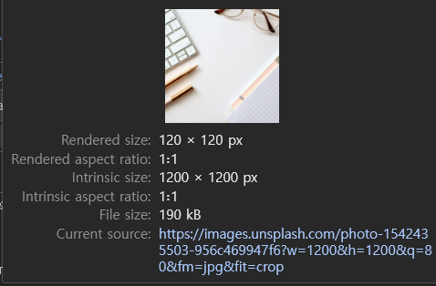

실제 이미지 사이즈는 1200px X 1200px인데 화면에 그려지는 이미지의 사이즈는 120  X 120px이라고 함. 그러니까 어차피 큰 사이즈의 이미지를 사용해도 1200 X 1200px로 표시하지 못하니 처음부터 120 X 120px에 맞는 이미지를 사용하라는 뜻.

단순히 화면에 표시되는 사이즈인 120 X 120px로 만들어야 한다고 생각할 수 있다.
물론 틀린 말은 아니다. 하지만 요즘 사용되는 레티나 디스플레이는 같은 공간에 더 많은 픽셀을 그릴 수 있기 떄문에 너비 기준으로 두 배 정도 큰 이미지를 사용하는 것이 적접하다. 즉 240 X 240px 사이즈로 사용하는 것

이미지 사이즈를 줄이는 법은 어디서 오는지 파악해야 함.
여기서 이미 알고 있는 사실이 하나 있음. 화면에서 보여 주는 이미지를 포함한 블로그 글 목록은 API를 통해 전달되고 있는 것.

크롬 network 패널로 가보자.

자체적으로 가지고 있는 정적 이미지라면 사진 편집 툴을 이용하여 직접 이미지 사이즈를 조절하면 되는데, 이렇게 API를 통해 받아오는 경우에는 어떻게 이미 사이즈를 조절할까요?

이때 한가지 방법은 Coludinary나 Imgix 같은 이미지 CDN을 사용하는 방법

### 이미지 CDN

CDN이란 물리적 거리의 한계를 극복하기 위해 소비자와 가까운 곳에 컨텐츠 서버를 두는 기술을 의미함.

이미지 CDN은 이미지에 특화된 CDN이라고 볼 수 있다. 기본적인 CDN기능과 더불어 이미지를 사용자에게 보내기 전에 특정 형태로 가공하여 전해주는 기능까지 있음.

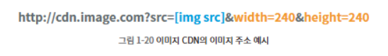

### 적절한 이미지 사이즈로 최적화

getParamertersForUnsplash 함수로 전달되는 width, height를 240px으로 변경

## 병목 코드 최적화

### Performance 패널 살펴보기

이번에는 Diagnostics 섹션의 Reduce Javascript exection time

오랫도안 자바스크립트가 실행되었고 그 때문에 서비스가 느려졌다는 것은 이해했는데 그게 무엇인지는 알 수 없다. 따라서 메인 스레드의 작업을 상세하게 살펴보고 느린 작업이 무엇인지 확인하기 위해 Performance 패널을 활용할 것.

Performance 패널을 사용하는 방법 두가지.
1. Lighthouse 결과 페이지에 view original tree라는 버튼이 있는데,이 버튼을 눌러 Performance 패널로 이동하는 방법임. 이 버튼을 통해 이동하면, Lighthouse를 통해 분석한 내용을 Performace 패널로 가져가서 보여줌.

view original trace을 이용하여 Performace패널로 이동하는 방법.

2. 패널로 직접 이동하여 분석을 진행하는 방법.

Performance 패널을 찾아 들어간 뒤, 새로고치맣여 다시 로드 되면서 그 과정에서의 여러 작업을 기록함. 이때 서비스의 상태를 조금 더 상세히 보려면 설정을 눌러 네트워크 설정으로 fast 3g로 설정

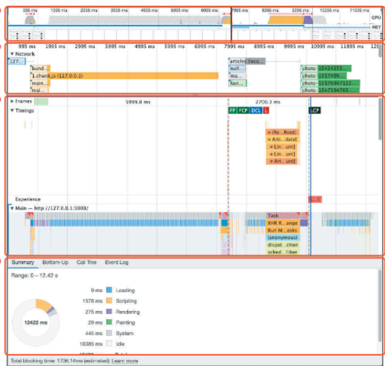

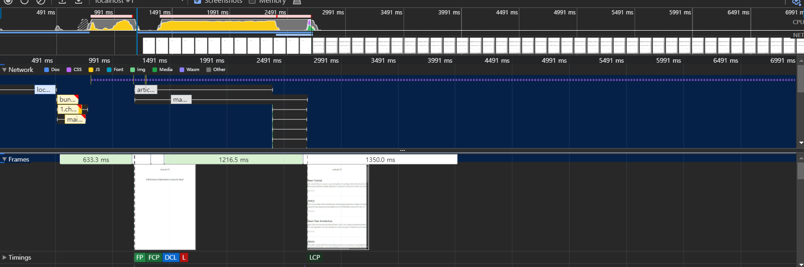

자바스크립트 실행 작업은 노란색

렌더링/레이아웃 작업은 보라색

페인팅 작업은 초록색

기타 시스템 작업은 회색으로 표시

빨강색은 병목이 발생하는 지점

특정 작업이 메인 스레드를 오랫동안 잡아 두고 있는 뜻.

Network 차트는 CPU 차트 밑에 막대 형태로 표시됨. 여기서는 대략적인 네트워크 상태를 보여줌. 위쪽의 진한 막대는 우선순위가 높은 네트워크 리소스를, 아래쪽의 옅은 막대는 우선순위가 낮은 네트워크 리소스를 나타냄.

### Network 타임라인

Network 패널과 유사하게 서비스 로드 과정에서의 네트워크 요청을 시간 순서에 따라 보여줌.

- 왼쪽 회색 선: 초기 연결 시간
- 막대의 옅은 색 영역: 요청을 보낸 시점부터 응답을 기다리는 시점까지의 시간(TTFB, Time to First Byte)
- 막대의 짙은 색 영역: 콘텐츠 다운로드 시간
- 오른쪽 회색 선: 해당 요청에 대한 메인 스레드의 작업 시간

### Frames,Timings,Main

Frames 섹션은 화면의 변화가 있을 때마다 스크린샷을 찍어 보여줌.

Timings 섹션은 User Timing API를 통해 기록된 정보를 기록함. 여기 표시된 막대들은 리액트에서 각 컴포넌트의 렌더링 시간을 측정한 것.

Main 섹션은 브라우저의 메인 스레드에서 실행되는 작업을 플레임 차트로 보여줌. 이를 통해 어떤 작업이 오래 걸리는지 파악할 수 있다.

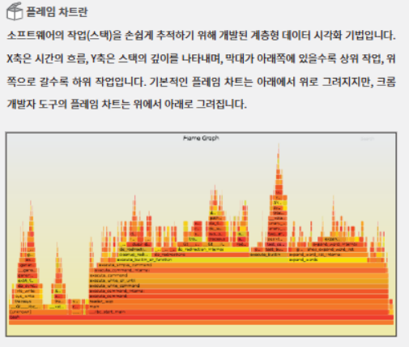

### 하단 탭

Summary, Bottom-up,Call tree, Event Log 탭에서는 전체 또는 선택된 영역에 대한 상세 내용을 확인할 수 있다.

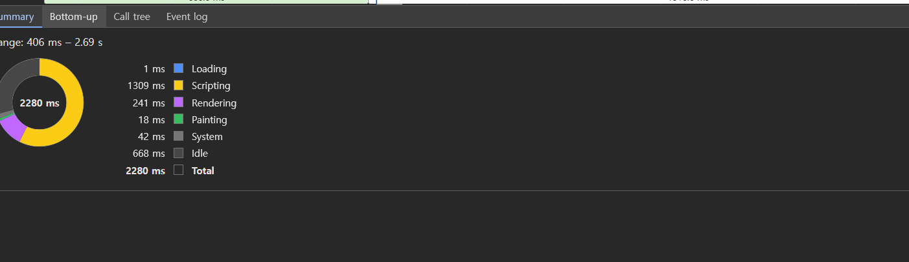

Summary 탭은 선택 영역에서 발생한 작업 시간의 총합과 각 작업이 차지하는 비중을 보여줌. Bottom-Up 탭은 가장 최하위에 있는 작업부터 상위 작업까지 역순으로 보여 줌.
Call tree 탭은 Bottom-up과 반대로 가장 상위 작업부터 하위 작업 순으로 작업 내용을 트리뷰로 보여 줌.

Event Log 탭은 발생한 이벤트를 보여 줌.
이벤트 로는 Loading, Experience, Scripting, Rendering, Painting

### 페이지 로드 과정 살펴보기

이 파란색 막대는 HTML 파일에 대한 요청을 의미함.

그리고 이어서 bundle.js, 1.chunk.js, main.chunk.js 등의 파일을 로드하고 있다.

확장자를 보면 알 수 있듯 주황색 막대는 자바스크립트 파일에 대한 요청을 의미함.

1.chunk.js의 로드 시가이 매우 길다는 것.

실제로 해당 막대를 클릭해 Summary 탭을 보면 파일 크기가 4.2MB로 굉장히 크다는 것을 알 수 있다.

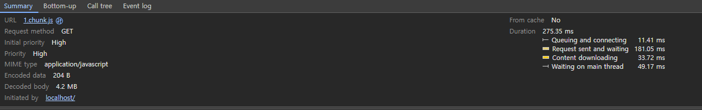

HTML 파일이 다운로드된 시점을 보면 메인 스레드에서는 Parse HTML 이라는 작업을 하고 있다. 아마 네트워크를 통해 받은 HTML을 처리하고 있는 듯하다.

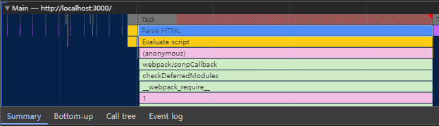

1.chunk.js의 다운로드가 끝난 시점을 보면, 이어 자바스크립트 작업이 실행되고 있다.

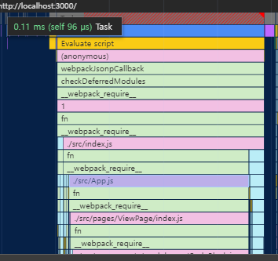

이 작업들은 리액트 코드를 실행하는 작업이라고 볼 수 있다.

Timings 섹션에서도 메인 스레드의 자바스크립트 작업이 끝나는 시점에 컴포넌트에 대한 렌더링작업이 기록되어 있음을 확인할 수 있다.

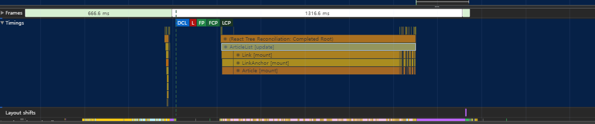

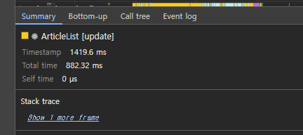

removeSpecialCharacer라는 작업도 보인다. 이 index.js에서 사용되는 함수인데 여기서 많은 시간을 사용한다 최적화를 위한 가장 중요한 포인트를 찾았다.

### 병목 코드 개선

removeSpecialCharacter 함수는 각 특수 문자마다 반복문을 돌려 본문에 일치하는 내용을 탐색하고 제거함. 그런데 일치하는 문자열을 찾고 제거하기 위해 반복문 두 번 중첩해서 사용하고 있고, 문자열을 제거하는 데도 substring과 concat 함수를 이용하고 있다.

2가지 방법이 존재한다.

특수 문자를 효율적으로 제거하기

substring과 concat 함수 대신 replace 함수를 사용

작업량 줄이기

articles API에 있는 블로그 글 데이터는 굉장히 긴 문자열 무려 9만개나 된다.

사실 서비스에서 사용되는 건 대력 200자 정도임. 그러면 굳이 9만자나 되는 문자열을 모두 탐색할 필요 없다. 필요한 길이 정도만을 빨라서 탐색하고 변경하면 좋을거 같다.
